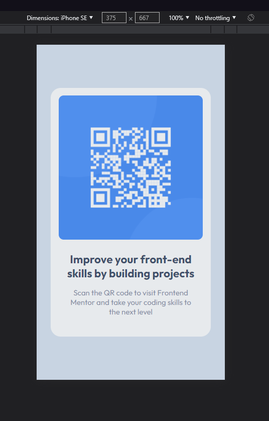
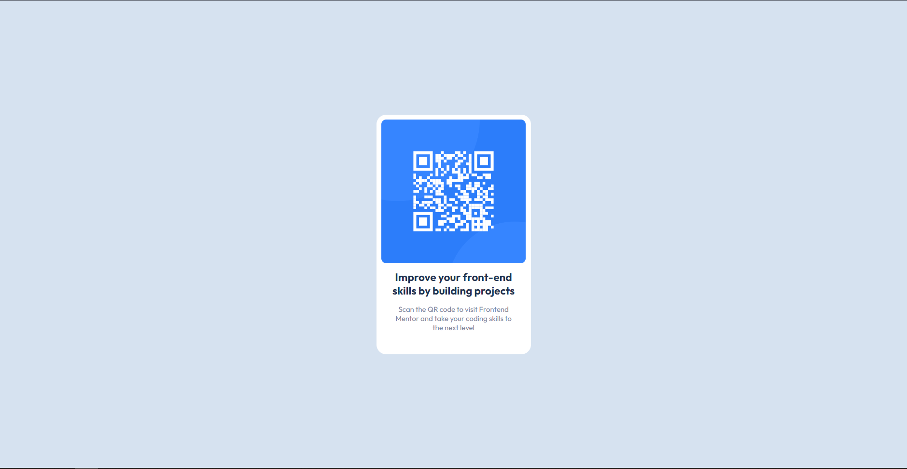

# Frontend Mentor - QR code component solution

This is a solution to the [QR code component challenge on Frontend Mentor](https://www.frontendmentor.io/challenges/qr-code-component-iux_sIO_H). Frontend Mentor challenges help you improve your coding skills by building realistic projects. 

## Table of contents

- [Overview](#overview)
  - [Screenshot](#screenshot)
  - [Links](#links)
- [My process](#my-process)
  - [Built with](#built-with)
  - [What I learned](#what-i-learned)
- [Author](#author)

## Overview

### Screenshot

### Links

- Link to Repo: [Repo](https://github.com/jacobnighdev/qr-code)
- Live Site URL: [QR Code App](https://qr-code-ten-mu.vercel.app)

## My process

### Built with

- [React](https://reactjs.org/) - JS library
- HTML
- CSS

### What I learned

- Finally getting back into the swing of things. Doing a project like this was nice for me to relearn all of things I had forgotten. HTML inside of React was a great refresher. Learning more about using CSS and using flexbox to achieve part of this solution.  

## Author

- Frontend Mentor - [@jacobnighdev](https://www.frontendmentor.io/profile/jacobnighdev)

